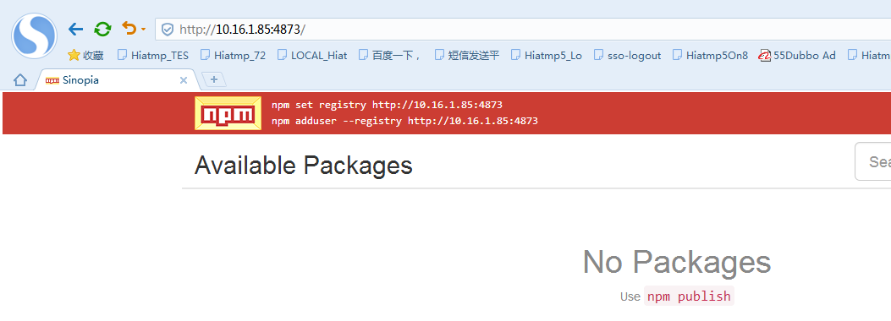
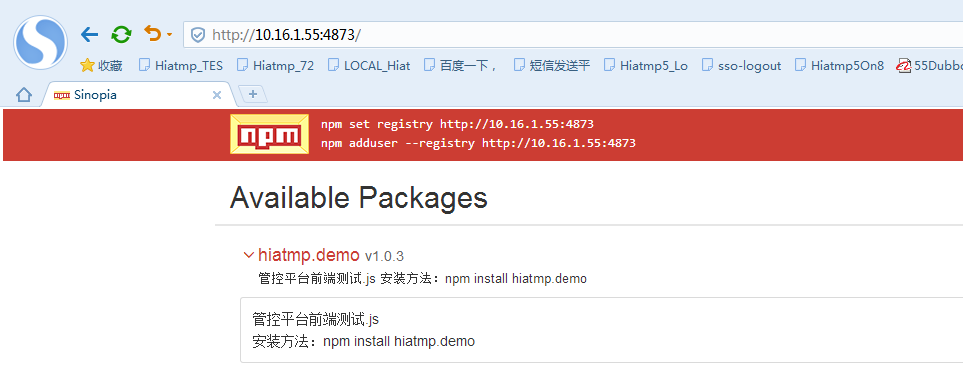

# 管控平台前端框架说明
- [框架介绍](#1)
- [环境配置](#2)
- [工程搭建](#3)
- [开发指导](#4)

## <span id='1'>1. 框架介绍</span>
管控平台前端框架以React技术为核心，搭配使用ant design组件库及dva-cli脚手架。

一个现代化的前端工作流通常由以下三部分组成：

- **包管理器** ：比如Yarn或Npm，可以让你更方便使用第三方库而不用自己造轮子

- **编译器** ：比如Babel，能翻译使用了最新语法的代码到浏览器兼容较好的版本

- **打包器** ：比如Webpack或Browserify，让你能够编写各种风格的模块化的代码，由它们打包和压缩

基于以上工作流，我们采用**npm**作为包管理器，使用**Babel**将ES6和JSX编译成ES5，最终应用于生产环境的代码采用**webpack**打包压缩。

使用该框架要求开发人员掌握react技术栈相关技术，具体如下：（学习过程参考[这里](#5.1))
- ES6 ： 掌握
- react : 掌握
- react-router : 掌握
- redux ： 了解
- npm : 了解，能够使用
- webpack : 了解

## <span id='2'>2. 环境配置</span>
### 2.1 nodejs
使用npm包管理器需安装nodejs。官网下载最新版，根据提示安装即可。

安装后，研发中心环境需配置npm本地仓库地址:

    npm set registry http://10.16.1.55:4873
注：这里使用了Sinopia 搭建npm本地服务器，有关Sinopia搭建过程请参考[《npm私服搭建说明》](#5.2)
### 2.2 IDE
不限制IDE工具的选择，推荐使用webstorm。

安装完webstrom后，需要进行如下配置：
- 禁用"safe write"选项（解决webpackdevserver不自动刷新问题）： Settings - Apperance & Behavior - System Settings,取消勾选"use safewrite"选项
- 将"node_modules" 添加到忽略列表中（加快索引速度）： File-Settings-Editor-File Types 最下面 Ignore files and folders 添加 "node_modules;"

### 2.3 其他
- **svn工具调整(重要!)** : 需要将node_modules添加到svn忽略列表中
- 不支持IE10以下浏览器，推荐安装使用chrome浏览器
- 推荐安装react谷歌浏览器调试插件 "React Developer Tools"

## <span id='3'>3. 工程搭建</span>
### 3.1 工程说明
前端项目配置较复杂，因此创建 **hiatmp-base** 基础项目，预先将配置项、依赖关系设置好，新建项目时复制hiatmp-base，调整几个参数即可。

**hiatmp-base**工程基于脚手架工具 [dva-cli](https://github.com/dvajs/dva/blob/master/README_zh-CN.md)，感兴趣的可以参考《hiatmp-base工程搭建过程》。

公共资源（如图片、公共组件、通用方法），放到 **hiatmp-core** 工程中，各子系统通过npm引入使用(hiatmp-base工程已添加该项依赖)

    npm install hiatmp-core --save
### 3.2 新建工程

按照如下步骤新建一个前端工程：
1. 复制hiatmp-base工程，重命名为具体的工程名称

2. cmd切换到工程目录下，执行 `npm install`命令

3. 修改`package.json`,`name`调整为工程名称，如`hiatmp-tles`

4. 修改`.roadhogrc`文件,`proxy`调整为合适的后端地址

5. 在工程目录下执行命令`npm start`，查看是否能够正常启动

注：
1. hiatmp-base 工程地址 : https://10.18.1.2:9011/svn/HiATMP5.0/trunk/src/chancheng/hiatmp-base

2. hiatmp-core 工程地址 : https://10.18.1.2:9011/svn/HiATMP5.0/trunk/src/chancheng/hiatmp-core

3. hiatmp-base 工程依赖 hiatmp-core 工程，在执行`npm install`时会从npm服务器上下载hiatmp-core工程，研发中心环境下已搭建好npm服务器，其他各地环境需自行搭建npm服务器，并将hiatmp-core工程上传到服务器上。

### 3.3 工程配置
共有2个配置文件，分别为`.roadhogrc` 和 `package.json`。二者功能有所不同：

- `package.json`文件为nodejs工程的配置文件,负责配置npm命令、版本号等通用项

- `.roadhogrc` 文件里有各个配置项，可以配置主题、代理地址等与具体项目相关的配置

下面是几个常用的配置，完整的配置请参考[这里](https://github.com/sorrycc/roadhog#%E9%85%8D%E7%BD%AE)
- **启动端口设置** :修改`package.json`文件，`start`命令调整为：`set port=3002 && roadhog server`

## <span id='4'>4. 开发指导</span>
### 4.1 目录结构
- **lib/** : babel编译后的输出路径，用于发布共享模块到npm仓库

- **mock/**: 数据模拟，暂未使用

- **node_modules/** : npm依赖包

- **public/** : 静态资源，存放不希望被webpack打包的静态资源。该目录下的文件在打包时会原样复制到dist目录下

- **src/** : 工程源代码，构建时被webpack打包输出到dist目录下

- **.babelrc** : babel 配置文件

- **.editorconfig** : 编辑器配置文件，用于不同编辑器间共享配置，未使用

- **.eslintrc** : 代码检查配置文件

- **.gitignore** : git忽略列表，未使用

- **.roadhogrc** : 工程配置文件

- **.roadhogrc.mock.js** : 未使用

- **package.json** : nodejs工程配置文件


### 4.2 开发教程

项目采用前后端分离开发模式，通过restful API进行前后端数据通信。每个项目最终都会编译为一个单页面应用，通过路由跳转来记录页面中的板块变化。

[快速上手](https://github.com/dvajs/dva-docs/blob/master/v1/zh-cn/getting-started.md)

[完整教程](https://github.com/dvajs/dva-docs/blob/master/v1/zh-cn/tutorial/01-%E6%A6%82%E8%A6%81.md)

### 4.3 hiatmp-core 工程介绍
hiatmp-core 工程中存放各子系统公用的资源，包括图标、工具类、自定义组件。

#### 图标
图标存放在 lib/assets/目录下，通过如下方式引入：
```javascript
import icon_add from 'hiatmp-core/lib/assets/images/common/icon_add.png'
```
#### 工具类
工具类存放在lib/utils/目录下，通过如下方式引入：
```javascript
import request from 'hiatmp-core/lib/utils/request'

//查询违法数据
export async function query(params){
  return request('/api/illegaldata/queryList',{
    method:'POST',
    body:JSON.stringify(params)
  })
}
```
下面是所有工具类清单:
- **request** :封装fetch方法,添加**身份验证**功能。所有后台请求方法都需要调用这个接口，不允许自定义实现。
```javascript
/**
 * Requests a URL, returning a promise.
 *
 * @param  {string} url       The URL we want to request
 * @param  {object} [options] The options we want to pass to "fetch"
 * @return {object}           An object containing either "data" or "err"
 */
 export default function request(url, options) {}
```
-

#### 自定义组件
TODO

## 5. 附录
### <span id="5.1">5.1 学习资料</span>

*  基础
	* ES6语法
		* http://www.jianshu.com/p/ebfeb687eb70
		* http://es6.ruanyifeng.com/
	* npm、webpack构建工具
		* https://docs.npmjs.com/
		* http://webpackdoc.com/
		* http://www.jianshu.com/p/4df92c335617
	* babel
		* http://www.ruanyifeng.com/blog/2016/01/babel.html
	* CSS预处理技术（less、css module 等，可选）  
*  react技术栈
	* react基础教程
		* https://facebook.github.io/react/
		* http://www.ruanyifeng.com/blog/2016/09/react-technology-stack.html
	* react-router
		* http://www.uprogrammer.cn/react-router-cn/index.html
	* redux
		* http://www.redux.org.cn/
	* redux-saga
		* http://leonshi.com/redux-saga-in-chinese/docs/api/index.html
* 组件库
	* ant design
		* https://ant.design/
	* dva-cli
		* https://github.com/dvajs/dva
* 前端发展史
	* http://www.chinaz.com/web/2016/0107/492906.shtml
	* https://github.com/ruanyf/jstraining/blob/master/docs/history.md

### <span id='5.2'>5.2 npm 私服搭建说明</span>
1.	服务器NodeJS安装
 1. 私服搭建需要单独的服务器。
 2. 下载对应版本的NodeJS安装包，我们要在Linux服务器上部署私服，所以下载了Linux版的安装包，为了安装方便，直接下载编译好的bin压缩包，如node-v6.10.0-linux-x64.tar.xz
 3. 解压缩压缩包 `tar xvf node-v6.10.0-linux-x64.tar.xz`
 4. 创建程序的链接（以在/home目录解压缩为例，其它目录相应修改以下斜体字：
```
    # ln -s /home/node-v6.10.0-linux-x64/bin/node /usr/bin/node
    # ln -s /home/node-v6.10.0-linux-x64/bin/npm /usr/bin/npm
```

 5. 测试程序是否能正常运行：输入node -v，正常显示版本号说明安装正常
```
# node -v
v6.10.0
```
2.	服务器安装私服程序包sinopia
  1. 安装程序包（确保服务器可以连接互联网）
  2. 在目录下生成了对应的链接说明安装成功
  3. 启动私服
  4. 访问一下主页地址，能够正常显示说明启动成功。



  修改私服配置文件，如3)步所示/root/.config/sinopia/config.yaml是配置文件的地址，改成如下内容：
  ```
  #
  # This is the default config file. It allows all users to do anything,
  # so don't use it on production systems.
  #
  # Look here for more config file examples:
  # 更多的配置项，看这里：
  # https://github.com/rlidwka/sinopia/tree/master/conf
  #  
  # 建议在安全上多做考虑，因为这个registry在开发环境和生产环境我们都是需要的
  listen: 0.0.0.0:4873  
  # 包的缓存位置
  storage: \home\sinopia_storage  
  # 发布私有包时，需要验证用户，此处进行用户管理
  auth:
    htpasswd:
      file: ./htpasswd
      # Maximum amount of users allowed to register, defaults to "+inf".
      # You can set this to -1 to disable registration.
      #max_users: 1000  
  # a list of other known repositories we can talk to
  # 使用淘宝的cnpmjs镜像，加速
  uplinks:
    npmjs:
      url: https://registry.npm.taobao.org/  
  # 识别@hiatmp/xxxx这样的package为Private的，其他的@xx/yyy都会到upstream去获取
  packages:
  '@hiatmp/*':
    # scoped packages
    access: $all
    publish: $authenticated
    '*':
    # allow all users (including non-authenticated users) to read and
    # publish all packages
    #
    # you can specify usernames/groupnames (depending on your auth plugin)
    # and three keywords: "$all", "$anonymous", "$authenticated"
    access: $all
    # allow all known users to publish packages
    # (anyone can register by default, remember?)
    publish: $authenticated
    # if package is not available locally, proxy requests to 'npmjs' registry
    proxy: npmjs
    # log settings
    logs:
        - {type: stdout, format: pretty, level: http}
        #- {type: file, path: sinopia.log, level: info}    
  ```
  5.修改后重启sinopia
3.	客户机配置使用私服：
  1. 在开发人员电脑上执行以下指令以启用私服：
  ```
  npm set registry http://10.16.1.55:4873/
  ```

4.	客户机配置使用私服：
  1. 因为私服设置了只有验证用户才能上传，所以首先要创建用户，我们以demo用户为例
  ```
  >npm adduser
Username: demo
Password:
Email: (this IS public) demo@hisense.com
Logged in as demo on http://10.16.1.55:4873/.
```
  2. 测试上传
  编写一个测试包，保存为package.json
  ```json
  {
  "name": "hiatmp.demo",
  "version": "1.0.3",
  "main": "index.js",
  "scripts": {
    "test": "echo \"Error: no test specified\" && exit 1"
  },
  "author": "demo",
  "license": "ISC",
  "description": "管控平台前端测试.js   \r 安装方法：npm install hiatmp.demo",
  "readme": "管控平台前端测试.js   \r\n安装方法：npm install hiatmp.demo \r\n",
  "readmeFilename": "README.md",
  "_id": "hiatmp.demo@1.0.0",
  "_from": "hiatmp@"
}
  ```
  3. 执行上传指令 npm publish
```
  >npm publish
  +hiatmp.demo@1.0.3
```
  查看上传结果


