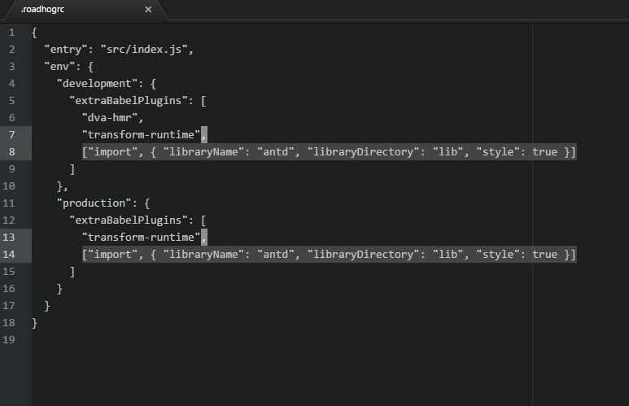

# 如何创建hiatmp-base工程
hiatmp-base 工程基于dva-cli脚手架工具创建。在此基础上添加了antd组建库与hiatmp-core工程依赖，为了方便共享还添加了babel相关的依赖。创建步骤如下:

1. 安装nodejs

2. 安装dva-cli 脚手架工具: `npm install dva-cli -g`

3. 命令窗口中切换到指定目录下，创建dva项目 `dva new hiatmp-base`。脚本会从自动npm服务器下载安装相应的依赖包

4. 启动测试
  ```
  $ cd hiatmp-base
  $ npm start
  ```
5. 安装`antd`组建库
  1. 在命令窗口中切换到`hiatmp-base`目录，执行命令:
    ```
    npm install antd babel-plugin-import --save
    ```
    babel-plugin-import 是用来按需加载 antd 的脚本和样式的。

  2. 编辑`.roadhogrc`,使`babel-plugin-import` 插件生效：
    ```
    ["import", { "libraryName": "antd", "libraryDirectory": "lib", "style": true }]
    ```
  

  3. 下载字体图标[WebFont](https://ant.design/docs/resource/download-cn),放到public目录下

  4. 编辑.roadhogrc,使字体图标生效


  5. 设置publicPath,用于生产环境:


6. 前后台联调

  1. 编辑.roadhogrc,添加代理地址


7. 公共模块引入
  ```
  npm install hiatmp-core --save
  ```

8. 共享模块发布

  子系统在开发过程中，有时候需要公开一些公共方法供其他子系统使用。 这时候需要将模块上传到npm本地服务器，其他系统通过添加依赖方式引入。引入方式如下：
  ```
  npm add hiatmp-core --save
  ```
  引入后hiatmp-core模块会出现在node_modules文件夹里。而各系统开发采用的是ES6语法，在编译时通过babel转码成ES5。在此过程中babel是不会转码node_modules文件夹下的代码的，因此，公共模块在共享前还需先进行转码。

  1. 添加babel依赖:
  ```
  npm install babel-cli babel-loader babel-preset-es2015 babel-preset-react babel-preset-stage-0 css-loader react react-dom rimraf style-loader --save-dev
  ```
  2. 编辑package.json，删除"private":true ，并添加以下内容


  3. 根目录下添加.babelrc文件，输入以下内容

  4. `npm run compile`,测试编译是否成功

  5. `npm adduser --registry http://10.16.1.55:4873`

  6. `npm publish`
